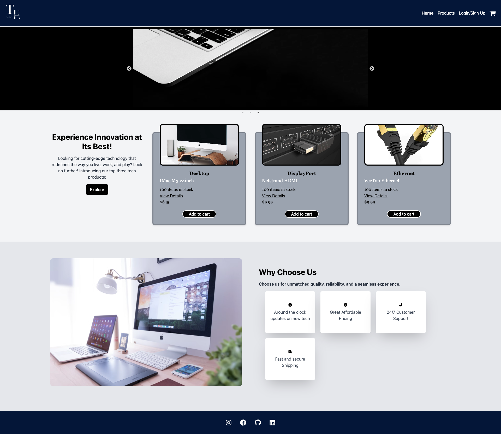

# Tech-E

## Description

Tech-E is a full-stack e-commerce web application.

- The motivation for this project was derived from the desire to build an on-line store that provides consumers an alternate place to purchase tech products.
- This project was another opportunity to utilize various technologies recently learned.
- The vast scope of this project made it an invaluable learning experience. It granted a close-up, end-to-end look at how such websites are built.

## Table of Contents (Optional)

- [Installation](#installation)
- [Usage](#usage)
- [Credits](#credits)
- [License](#license)

## Installation

npm install the the dependencies and dev dependencies in the package json at the client, server, and root level.

## Usage

Heroku link: https://still-fortress-07413-3ec76e5ba3ea.herokuapp.com/

   
1. npm run seed
2. npm run dev
3. visit the website in the browser

## Credits
Leif Hetland
Fred Kamm
Tutors
gfuselier@github.com
jakobpfeifer135@github.com
mdpfeifer1@github.com

## MIT License

Copyright (c) 2023 G6-2Flyy

Permission is hereby granted, free of charge, to any person obtaining a copy of this software and associated documentation files (the "Software"), to deal in the Software without restriction, including without limitation the rights to use, copy, modify, merge, publish, distribute, sublicense, and/or sell copies of the Software, and to permit persons to whom the Software is furnished to do so, subject to the following conditions:

The above copyright notice and this permission notice shall be included in all copies or substantial portions of the Software.

THE SOFTWARE IS PROVIDED "AS IS", WITHOUT WARRANTY OF ANY KIND, EXPRESS OR IMPLIED, INCLUDING BUT NOT LIMITED TO THE WARRANTIES OF MERCHANTABILITY, FITNESS FOR A PARTICULAR PURPOSE AND NONINFRINGEMENT. IN NO EVENT SHALL THE AUTHORS OR COPYRIGHT HOLDERS BE LIABLE FOR ANY CLAIM, DAMAGES OR OTHER LIABILITY, WHETHER IN AN ACTION OF CONTRACT, TORT OR OTHERWISE, ARISING FROM, OUT OF OR IN CONNECTION WITH THE SOFTWARE OR THE USE OR OTHER DEALINGS IN THE SOFTWARE.

